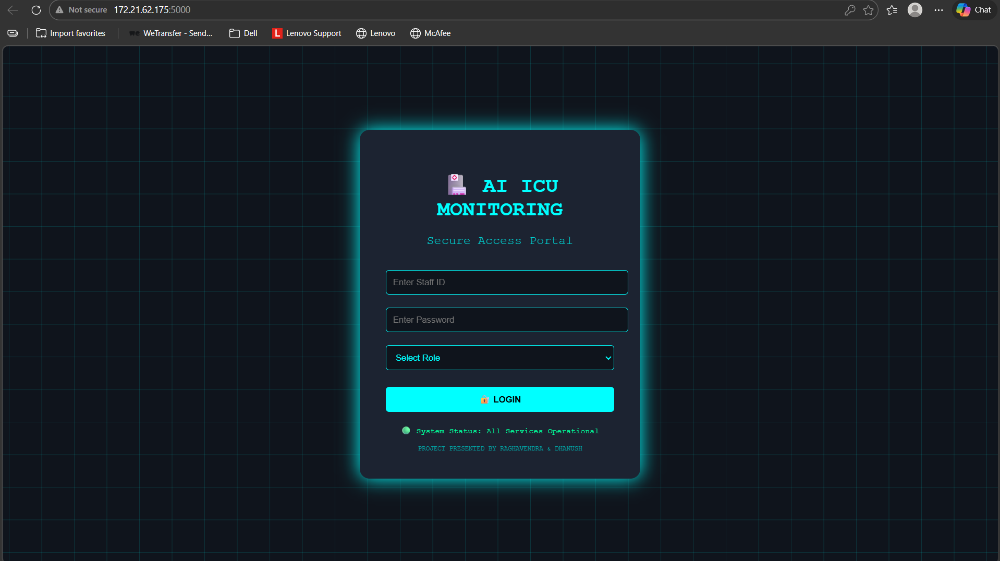
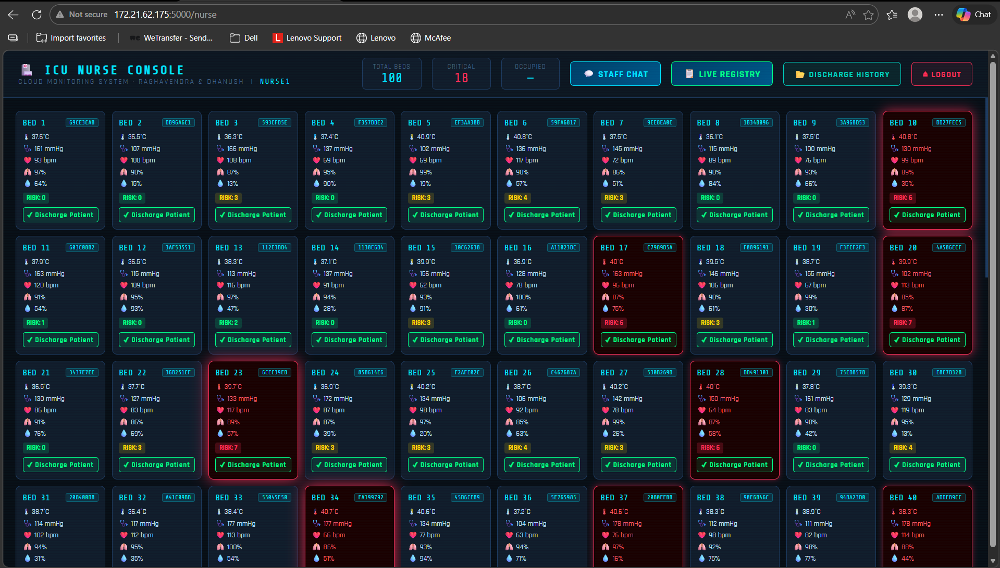
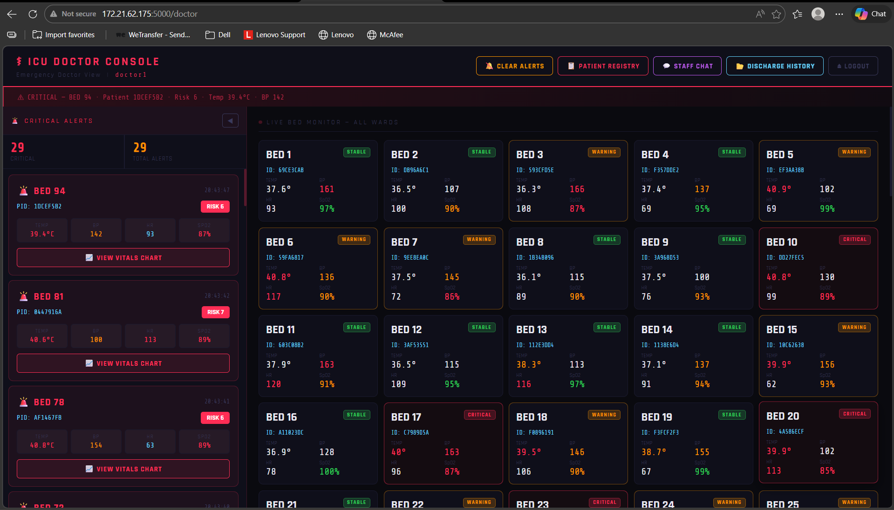
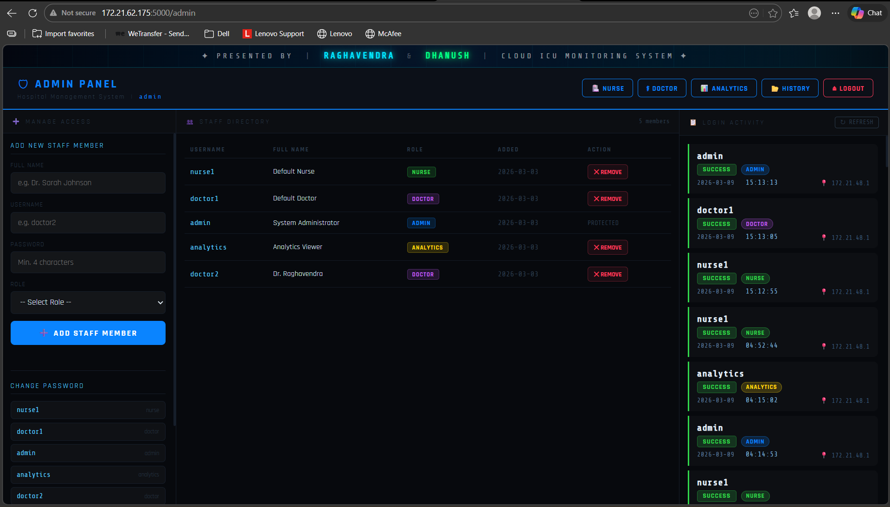

# 🏥 Smart ICU Cloud — Real-Time Hospital Monitoring System

<p align="center">
  
  
  
  
  
  
</p>

<p align="center">
  A full-stack, cloud-based Smart ICU monitoring system that uses the <b>CoAP IoT protocol</b> to stream real-time patient vitals from 100 simulated beds to a secure multi-role hospital dashboard — with AI-based risk scoring, WebSocket alerts, and a permanent discharge registry.
</p>

<p align="center">
  <b>Built by Raghavendra Meda</b>
</p>

---

## 📸 Screenshots

### 🔐 Login Portal


### 👩‍⚕️ Nurse Console — 100 Live Beds


### 👨‍⚕️ Doctor Console — Critical Alerts


### 🛡️ Admin Panel — Staff & Audit Logs


### 📊 Hospital Analytics Dashboard


---

## 🌐 System Architecture

```
  [IoT Sensor Simulator]
         │
         │  CoAP POST (UDP:5683)
         ▼
  ┌─────────────────────┐
  │   CoAP Server       │  ← aiocoap (async, runs in background thread)
  │   (PatientResource) │
  └────────┬────────────┘
           │  Parse vitals → AI Risk Score → Store in DB
           ▼
  ┌─────────────────────┐
  │     SQLite DB       │  ← patients, beds, staff, discharge_history, chat, logs
  └────────┬────────────┘
           │
           │  WebSocket (Socket.IO)
           ▼
  ┌─────────────────────┐
  │   Flask Web Server  │  ← Role-based REST API + real-time events
  │   (port 5000)       │
  └────────┬────────────┘
           │
    ┌──────┴──────┐
    │  Browser UI  │
    │  (4 roles)   │
    └─────────────┘
```

---

## ✨ Features

### 🔐 Authentication & Security
- Secure login with Staff ID, Password, and Role selection
- Role mismatch detection — prevents privilege escalation
- Login audit trail — every access attempt logged with IP, timestamp, and status
- Session-based access control across all routes

### 👩‍⚕️ Nurse Dashboard
- Live feed of all 100 ICU beds updating in real-time via WebSockets
- Admit and discharge patients with one click
- Saline level monitoring with low-level alerts
- Isolation flag toggle per bed
- Real-time staff chat room

### 👨‍⚕️ Doctor Dashboard
- Instant critical alerts (risk score ≥ 5) via Socket.IO push
- Per-bed vitals history with Chart.js graphs (Temperature, BP, HR, SpO2)
- Current patient ID and bed status tracking
- Access to analytics overview

### 🛡️ Admin Panel
- Full staff management — add, delete, change passwords
- Configurable alert thresholds (Temperature, BP, SpO2)
- System-wide login log viewer (last 200 entries)
- Bed occupancy overview

### 📊 Analytics Dashboard
- Hospital-wide averages: Temperature, BP, Heart Rate, SpO2
- Critical patient count
- Discharge history stats — total discharged, unique patients, high-risk cases
- Busiest beds report

### 📋 Discharge History Registry
- Permanent record of every patient ever admitted
- Per-patient summary: avg vitals, max risk score, total readings, admitted/discharged times
- Searchable by Patient ID, Bed Number, and Date Range
- Never cleared — acts as a full hospital registry

### 🤖 AI Risk Scoring Engine

| Condition | Points |
|---|---|
| Temperature ≥ 38°C | +1 |
| Temperature ≥ threshold (default 39°C) | +2 |
| BP > threshold (default 160 mmHg) | +2 |
| SpO2 < threshold (default 90%) | +3 |
| Heart Rate > 110 bpm | +1 |
| **Total Score ≥ 5** | **🚨 Doctor Alert Triggered** |

---

## 🛠️ Tech Stack

| Layer | Technology |
|---|---|
| IoT Protocol | CoAP (aiocoap) over UDP |
| Backend | Python 3, Flask, Flask-SocketIO |
| Real-time | Socket.IO WebSockets |
| Database | SQLite3 |
| Frontend | HTML5, CSS3, Vanilla JS |
| Charts | Chart.js |
| Concurrency | Python threading (CoAP + Flask in parallel) |
| Simulation | asyncio-based 100-bed IoT simulator |

---

## 📂 Project Structure

```
smart-icu-cloud/
│
├── server.py                    # Main server — Flask + CoAP + SocketIO
├── simulate.py                  # IoT sensor simulator (100 beds, CoAP POST)
│
├── templates/
│   ├── login.html               # Secure access portal
│   ├── nurse.html               # Nurse real-time dashboard
│   ├── doctor.html              # Doctor vitals + alerts dashboard
│   ├── admin.html               # Admin control panel
│   ├── analytics.html           # Hospital analytics overview
│   ├── discharge_history.html   # Patient discharge registry
│   ├── history.html             # Temperature history chart
│   └── dashboard.html           # Basic monitoring view
│
├── screenshots/                 # UI screenshots
├── requirements.txt
├── .gitignore
└── README.md
```

---

## 🚀 Getting Started

### Prerequisites
- Python 3.10+
- pip

### 1. Clone the Repository

```bash
git clone https://github.com/Raghavendra-01/smart-icu-cloud.git
cd smart-icu-cloud
```

### 2. Install Dependencies

```bash
pip install -r requirements.txt
```

### 3. Start the Server

```bash
python server.py
```

### 4. Run the IoT Simulator (in a second terminal)

```bash
python simulate.py
```

### 5. Open in Browser

```
http://localhost:5000
```

---

## 🔑 Demo Login Credentials

| Role | Username | Password |
|---|---|---|
| 👩‍⚕️ Nurse | `nurse1` | `1234` |
| 👨‍⚕️ Doctor | `doctor1` | `1234` |
| 🛡️ Admin | `admin` | `admin123` |
| 📊 Analytics | `analytics` | `analytics1` |

> ⚠️ These are demo credentials for local testing only. Change all passwords before any real deployment.

---

## 📦 Requirements

```
flask
flask-socketio
aiocoap
```

---

## 🗄️ Database Schema

The system uses 7 SQLite tables:

| Table | Purpose |
|---|---|
| `patients` | Every vitals reading ever recorded |
| `beds` | Current live status of all 100 beds |
| `staff` | Staff accounts (username, password, role) |
| `discharge_history` | Permanent patient discharge registry |
| `chat_messages` | Staff chat room history |
| `thresholds` | Admin-configurable alert thresholds |
| `login_logs` | Security audit log for all login attempts |

---

## ⚙️ How It Works

1. `simulate.py` acts as 100 IoT sensors, sending vitals every 25 seconds via **CoAP POST** to `coap://localhost/patient`
2. The **CoAP server** (running async in a background thread) parses each message, calculates a **risk score**, and writes to SQLite
3. If risk score ≥ 5, a **Socket.IO event** fires to all connected doctor dashboards instantly
4. All connected nurse dashboards receive a live `nurse_update` event simultaneously
5. The Flask REST API serves role-filtered data to each dashboard
6. When a nurse discharges a patient, a complete summary is permanently saved to `discharge_history`

---

## 🔮 Future Improvements

- [ ] Password hashing (bcrypt / Argon2)
- [ ] JWT-based stateless authentication
- [ ] Docker containerization
- [ ] Deploy to AWS / Azure / GCP
- [ ] Real hardware sensor integration (ESP32 + CoAP)
- [ ] ML-based predictive risk scoring (not just threshold rules)
- [ ] Email / SMS alerts for critical patients
- [ ] PDF discharge report generation
- [ ] HTTPS + WSS (secure WebSocket)

---

## 📄 License

This project is licensed under the [MIT License](LICENSE).

---

## 🙌 Author

**Raghavendra Meda**

[](https://github.com/Raghavendra-01)
[]([https://www.linkedin.com/in/raghavendra-meda](https://www.linkedin.com/in/raghavendra-meda-134167357/))

---

<p align="center">Built with ❤️ for the future of smart healthcare</p>
